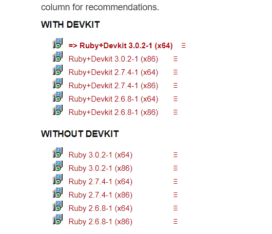
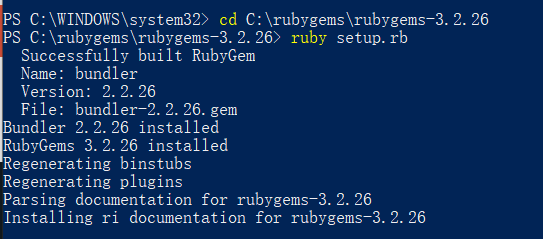

# [使用 Jekyll 创建 GitHub Pages 站点](https://docs.github.com/cn/pages/setting-up-a-github-pages-site-with-jekyll/creating-a-github-pages-site-with-jekyll)

---


## Ruby安装


- [安装地址](https://rubyinstaller.org/downloads/)

安装建议的2.7.4版本，然后根据自己的选项安装。



---


## Rubygem安装


- [安装地址](https://rubygems.org/pages/download)

下载zip文件，解压到自己新建目录中，运行cmd窗口

```apl
cd 解压后文件路径  -----cd C:\rubygems\rubygems-3.2.26
ruby setup.rb
```



---


## Bundler安装


- 用管理员权限运行cmd窗口，执行以下命令

- ```apl
  gem install bundler
  ```

---


## Jekyll安装


- 用管理员权限运行cmd窗口，执行以下命令

- ```apl
  ridk install
  gem intall jekyll
  ```

---

# [返回首页](https://nanaoy.github.io/)

